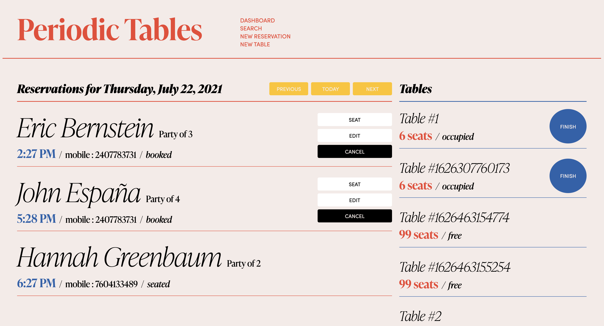
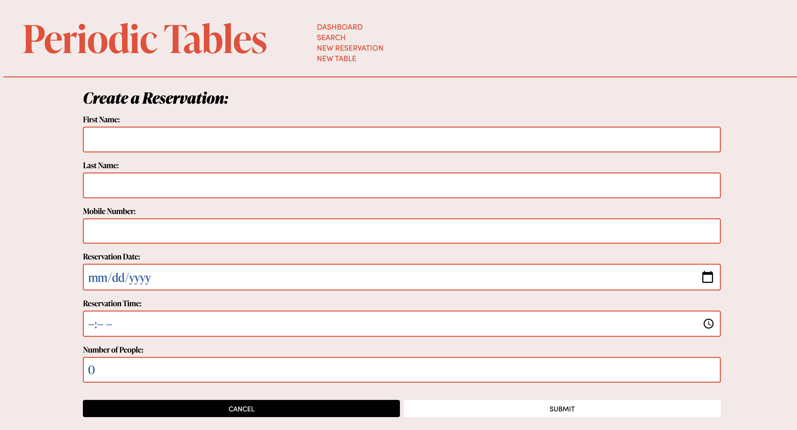
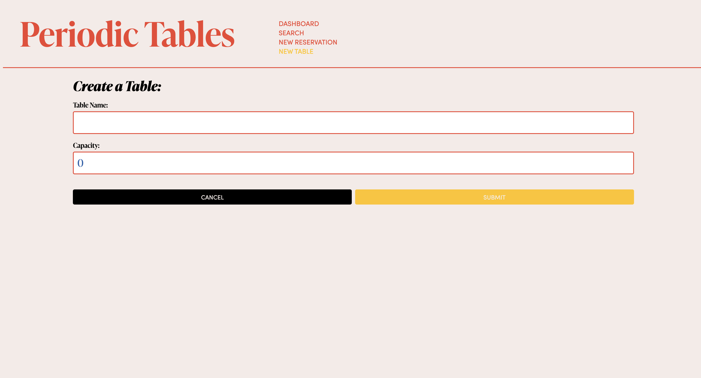
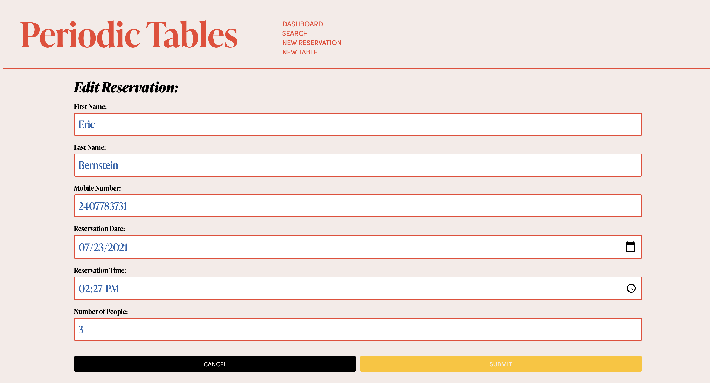
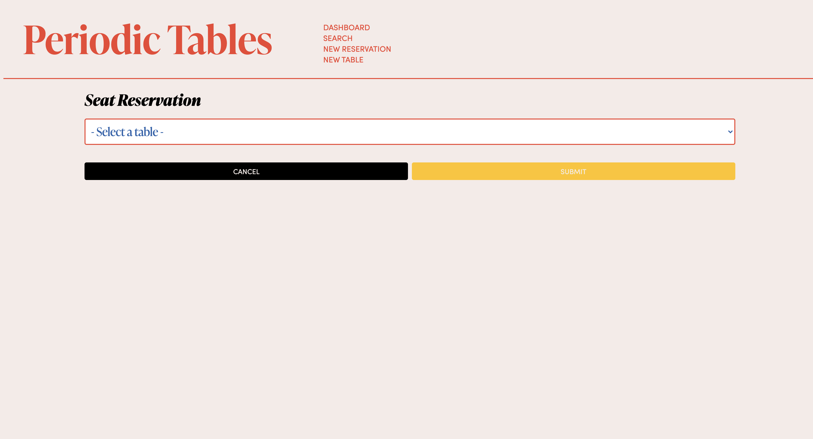
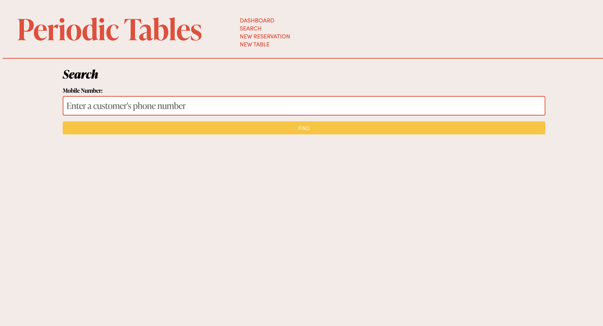

# **Periodic Tables:** Restaurant Reservation System

## Summary

This web application was created as my capstone project for Thinkful's Engineering Flex Program. The prompt called for the development of a React app, Node + Express server, and PostgreSQL database for Periodic Tables, a fictional startup that is creating a reservation system for fine dining restaurants. The software is meant to be used only by the restaurant personnel when a customer calls to request a reservation. Periodic Tables allows users to create and edit a reservation, list all reservations for a particular date, search for reservations by mobile number, create a new table, seat a reservation by assigning it to a particular table, free up a table by finishing a reservation, and cancel a reservation. The original assignment and user stories can be found at Thinkful's [original repo](https://github.com/Thinkful-Ed/starter-restaurant-reservation).

## Deployed Application

https://periodic-tables-web-client.herokuapp.com

## Tech Stack

**Client:** React, Javascript, CSS, HTML
**Server:** Node, Express, Knex
**Database:** PostgreSQL

## Client

#### Dashboard

The Dashboard page lists all reservations for a particular date, and each reservation contains buttons to Seat, Edit, or Cancel the reservation. The dashboard also lists all tables and each occupied table has a finish button so the client can free up the table.

#### Create a Reservation

The Create a Reservation page allows the client to create a new reservation by providing the first name, last name, mobile number, date, time, and number of people for the reservation.

#### Create a Table

The Create a Table page allows the client to create a new table and assign a table name and capacity.

#### Edit Reservation

The Edit Reservation page allows the client to edit the information of a selected reservation.

#### Seat Reservation

The Seat Reservation page allows the client to assign a reservation to a particular table.

#### Search

The Search page allows the client to search for reservations by a mobile number

## API

| Request | Path                                   | Description                                                 |
| ------- | -------------------------------------- | ----------------------------------------------------------- |
| GET     | /reservations                          | list all reservations, sorted by time                       |
| POST    | /reservations                          | create a new reservation                                    |
| GET     | /reservations/:reservation_id          | read a reservation by reservation_id                        |
| PUT     | /reservations/:reservation_id          | update a reservation by reservation_id                      |
| PUT     | /reservations/:reservation_id/status   | update a reservation status by reservation_id               |
| GET     | /reservations?mobile_number=XXXXXXXXXX | list all reservations for one mobile number, sorted by time |
| GET     | /reservations?date=XXXX-XX-XX          | list all reservations for one date, sorted by time          |
| GET     | /tables                                | list all tables, sorted by table name                       |
| POST    | /tables                                | create a new table                                          |
| PUT     | /tables/:table_id/seat                 | update a table and assign it to a reservation               |
| DELETE  | /tables/:table_id/seat                 | free an occupied table by deleting assigned reservation_id  |

## Installation

1. Fork and clone this repository.
1. Run `cp ./back-end/.env.sample ./back-end/.env`.
1. Update the `./back-end/.env` file with the connection URL's to your ElephantSQL database instance.
1. Run `cp ./front-end/.env.sample ./front-end/.env`.
1. You should not need to make changes to the `./front-end/.env` file unless you want to connect to a backend at a location other than `http://localhost:5000`.
1. Run `npm install` to install project dependencies.
1. Run `npm run start:dev` to start your server in development mode.
